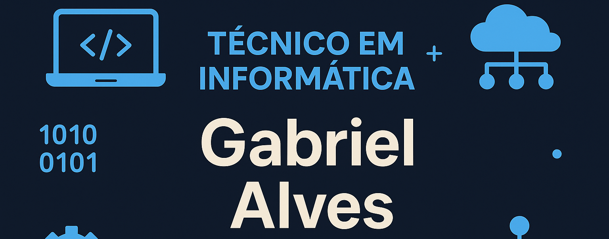

<h0 align="center">
<h1 align="center">Você constrói o seu futuro.</h1>
<h3 align="center">Seu futuro está em jogo, vamos moldá-lo! </h3>

# 💻 Técnico em Informática – SENAC Tatuapé

Olá! 👋  
Sou **Gabriel da Silva Alves**, estudante do curso **Técnico em Informática** pelo **SENAC Tatuapé (SP)**, e aqui compartilho minha jornada no mundo da **Tecnologia da Informação**.

## 🚀 Sobre o curso
O curso Técnico em Informática do SENAC é voltado para o desenvolvimento de competências práticas e teóricas na área de TI.  
Durante o aprendizado, estou desenvolvendo habilidades em:

- 🖥️ **Teoria de Hardware** – Montagem, manutenção e diagnóstico de computadores;  
- ⚡ **Elétrica e Eletrônica Básica com Arduino** – Fundamentos de circuitos, sensores e automação;  
- 🌐 **Sistemas Operacionais** – Instalação, configuração e administração de sistemas Windows e Linux;  
- 🧠 **Inteligência Artificial (IA)** – Introdução a conceitos de automação e uso de ferramentas inteligentes;  
- 🔄 **Git e GitHub** – Controle de versão, colaboração e publicação de projetos.

## 🧩 Objetivo
Aprofundar meus conhecimentos em tecnologia, expandir minha experiência prática e contribuir com soluções criativas no universo da informática.

## ⚙️ O que você vai encontrar aqui
Neste perfil, compartilho:
- Projetos e exercícios desenvolvidos durante o curso;  
- Experimentos com **hardware, software e automação**;  
- Materiais de estudo e aprendizados contínuos.

---

> — Gabriel Alves

---

📚 **Em constante aprendizado.**  
🔗 Fique à vontade para explorar meus repositórios e acompanhar minha evolução!
